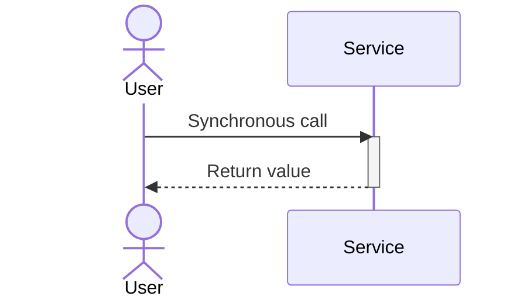
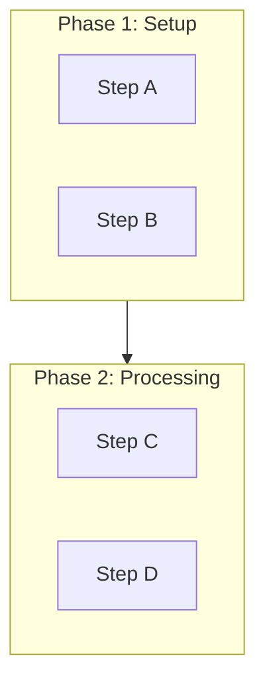
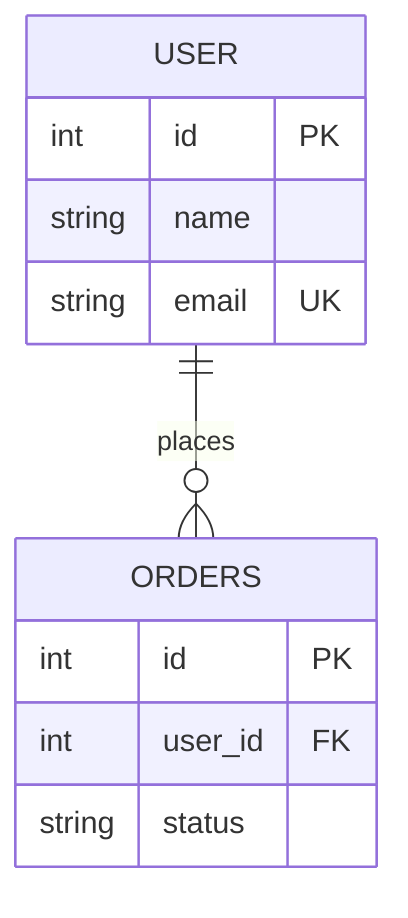
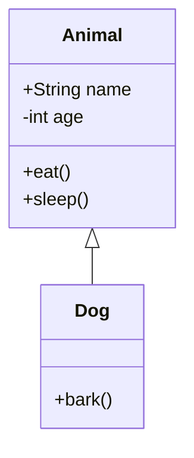
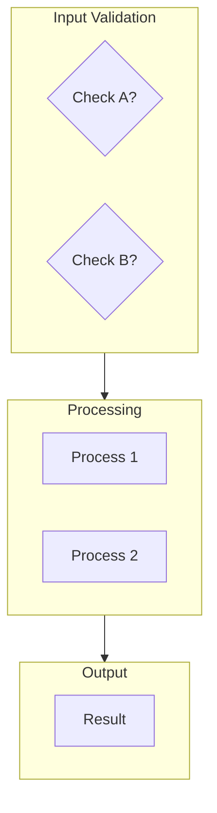

# Claude Code Development Guide

This guide is for developers using Claude Code to work with the Mermaid.js sample project.

## Project Overview

The Mermaid.js sample project is a comprehensive collection of diagram examples showcasing various Mermaid diagram types and patterns.

**Architecture: Markdown-First**
- All samples are stored as markdown (`.md`) files in the `samples/` directory
- Markdown files render natively on GitHub with Mermaid diagrams
- A generic `sample-viewer.html` fetches and renders markdown files in a web interface
- Single source of truth: no duplication between GitHub and web viewer

## Project Structure

```
mermaidjs-sample/
├── index.html                 # Main navigation page
├── sample-viewer.html         # Generic markdown viewer
├── samples/                   # All samples as markdown files
│   ├── 01-basic/             # 3 files - fundamental diagrams (.md files)
│   ├── 02-intermediate/      # 4 files - real-world patterns (.md files)
│   ├── 03-advanced/          # 5 files - specialized diagrams (.md files)
│   └── 04-complex/           # 4 files - large diagrams (.md files)
├── styles/main.css           # Shared styling
├── utils/mermaid-config.js   # Configuration and helper functions
└── package.json              # Project metadata (minimal)
```

## Architecture: Markdown-First Design

### Why Markdown?

1. **GitHub Native Rendering**: Mermaid diagrams display directly in markdown files on GitHub
2. **Single Source of Truth**: One file serves both GitHub and web viewer
3. **No Duplication**: Changes to samples update everywhere automatically
4. **Portable**: Works with any markdown viewer, any platform
5. **Easy Editing**: Just edit `.md` files, no HTML needed

### How It Works

1. **Markdown Storage** (`samples/XX-category/*.md`)
   - Each sample is a complete markdown file
   - Includes title, description, key features, and mermaid diagram
   - Can be viewed raw or rendered

2. **Sample Viewer** (`sample-viewer.html`)
   - Generic HTML page that reads markdown files
   - Fetches markdown via query parameter: `sample-viewer.html?path=samples/01-basic/flowchart.md`
   - Parses markdown and renders HTML
   - Initializes Mermaid for diagram rendering

3. **Index Navigation** (`index.html`)
   - Links to samples via sample-viewer with query parameters
   - No changes needed for GitHub - samples display natively

## Working with Samples

### Sample Markdown Format

Each sample markdown file follows this structure:

```markdown
# Diagram Title

Brief one-line description of the diagram.

## Use Case: Scenario Name

Full description of the use case (2-3 sentences). What problem does this diagram solve? When would you use this?

### Key Features
- Feature 1
- Feature 2
- Feature 3

### Sub-section (Optional)
Additional information about patterns, layout strategies, or special techniques demonstrated.

## Diagram

\`\`\`mermaid
flowchart TD
    Start(["Start"])
    Process["Do Something"]
    Decision{"Choice?"}
    End(["End"])

    Start --> Process
    Process --> Decision
    Decision -->|Yes| End
\`\`\`

## Concepts Demonstrated

**Important concepts** explained here. What syntax elements are shown? What patterns?

## Learning Tips

Guidance on when and how to use this diagram type. Best practices and things to avoid.
```

### Markdown Format Details

1. **Title** (H1): The diagram name (e.g., "Flowchart", "Sequence Diagram")
2. **Description**: One-line description after title
3. **Use Case** (H2): Descriptive scenario name
4. **Key Features** (H3): Bulleted list of what the diagram shows
5. **Diagram** (H2): The mermaid code block with triple backticks
6. **Concepts Demonstrated** (H2): Explanation of syntax elements
7. **Learning Tips** (H2): When and how to use this diagram type

### Key Advantages of Markdown

- **Renders on GitHub**: No special viewer needed for basic viewing
- **Parseable**: The sample-viewer.html parses markdown to HTML
- **Future Proof**: Works with any markdown platform
- **Single Source**: One file, viewed everywhere the same way

## Mermaid Syntax Patterns

### Basic Flowchart


**Syntax Tips:**
- `flowchart TD` = Top-Down direction (also: `LR`, `RL`, `BT`)
- `(["Rounded"])` = Terminal/start-end nodes
- `["Rectangle"]` = Process nodes
- `{"Diamond"}` = Decision nodes
- `-->` = Arrow connection
- `-->|Label|` = Labeled connection

### Sequence Diagram


**Syntax Tips:**
- `actor` = Human actor (different styling)
- `participant` = System/service
- `->>` = Synchronous message (solid arrow)
- `-->>` = Return/response (dashed arrow)
- `activate/deactivate` = Lifeline activation boxes

### Subgraphs for Organization


**Syntax Tips:**
- Subgraphs automatically group nodes
- Use descriptive subgraph names in quotes
- Subgraphs can be nested (avoid too much nesting)
- Great for organizing large diagrams

### Entity-Relationship


**Syntax Tips:**
- `||--o{` = One-to-many relationship
- `||--||` = One-to-one
- `o{--o{` = Many-to-many
- `PK` = Primary Key
- `FK` = Foreign Key
- `UK` = Unique Key

### Class Diagram


**Syntax Tips:**
- `+` = Public visibility
- `-` = Private visibility
- `#` = Protected visibility
- `<|--` = Inheritance
- `*--` = Composition
- `o--` = Aggregation

## Adding New Samples

### Step 1: Create the Markdown File
1. Choose the appropriate category directory (`01-basic`, `02-intermediate`, etc.)
2. Create a new `.md` file with descriptive name (e.g., `state-diagram.md`)
3. Use the markdown template format provided in the section above
4. Write clear descriptions and key features

### Step 2: Add the Mermaid Diagram
1. Write your Mermaid syntax in a code block: ` ```mermaid ... ``` `
2. Test the syntax with [mermaid.live](https://mermaid.live)
3. Include explanation of concepts and learning tips

### Step 3: Add Navigation Link
1. Edit `index.html`
2. Find the appropriate section (Basic/Intermediate/Advanced/Complex)
3. Add a new `nav-section` div with:
   - Diagram title
   - Brief description
   - Link to sample-viewer: `sample-viewer.html?path=samples/XX-category/filename.md`
   - Learning summary

### Step 4: Test and Validate
1. **View on GitHub**: Push to GitHub and verify markdown renders with diagram
2. **Test web viewer**: Open `http://localhost:8000` and click the link
3. **Check responsiveness**: Resize browser window
4. **Test dark mode**: Toggle theme button
5. **Verify links**: Check navigation works

### Step 5: No HTML Needed!
- The markdown file works everywhere
- GitHub renders it automatically
- The web viewer fetches and displays it
- No HTML duplication required

## Layout Strategies for Complex Diagrams

### For Large Flowcharts (30+ nodes)
1. **Use subgraphs**: Organize into logical phases
2. **Hierarchical flow**: Keep main flow top-to-bottom
3. **Group related decisions**: Keep related logic together
4. **Error paths separate**: Show error handling in distinct areas
5. **Abbreviate labels**: Full descriptions in accompanying text

Example structure:


### For Microservices Diagrams
1. **Layered organization**: API Gateway → Services → Data Layer → External
2. **Group by domain**: Related services together
3. **Use emojis**: Quick visual identification (🔐 Auth, 📦 Product, etc.)
4. **Show integration boundaries**: External services distinguished visually

### For Dependency Graphs
1. **Cluster by category**: Build tools, utilities, frameworks, testing
2. **Hierarchy by dependency**: Core dependencies at bottom
3. **Highlight shared dependencies**: Show packages used by many others
4. **Limit depth**: Don't show transitive dependencies of transitive deps

## CSS and Styling

### Using Main.css Classes

**Container classes:**
- `.container` - Main content wrapper (max-width: 1200px)
- `.sample-container` - Two-column grid layout
- `.diagram-container` - Diagram display area

**Color variables** (in `:root`):
- `--primary-bg` - Main background
- `--primary-text` - Main text color
- `--accent-color` - Links and highlights
- `--secondary-text` - Muted text

**Dark mode support:**
The CSS automatically applies dark theme when `body.dark-mode` class is added.

### Customizing Diagram Container

Default diagram container is 400px min-height. For complex diagrams:
```html
<div class="diagram-container" style="min-height: 600px; max-height: 800px;">
    <div class="mermaid">
        <!-- diagram here -->
    </div>
</div>
```

## Configuration

### Mermaid Initialize Options

Common options in the `<script>` tag:

```javascript
mermaid.initialize({
    startOnLoad: true,           // Auto-render diagrams
    theme: 'default',            // Theme (default, dark, forest, neutral)
    securityLevel: 'loose',      // Allow HTML in labels
    flowchart: {
        useMaxWidth: true,       // Responsive sizing
        htmlLabels: true,        // Allow HTML in labels
        curve: 'linear'          // Line style
    }
});
```

### For Different Diagram Types

**Sequence Diagrams:**
```javascript
sequence: {
    mirrorActors: true,          // Centered actors
    useMaxWidth: true
}
```

**Flowcharts (Large):**
```javascript
flowchart: {
    useMaxWidth: true,
    htmlLabels: true,
    defaultRenderer: 'dagre-d3'  // Better layout for large graphs
}
```

## Common Challenges and Solutions

### Issue: Diagram not rendering
**Solution:** Check that:
- The `.mermaid` class is on the container div
- Mermaid.js script is loaded (check browser console)
- Syntax is valid (use mermaid.live for testing)

### Issue: Diagram too large or cut off
**Solution:**
- Increase container height: `min-height: 800px`
- Use `useMaxWidth: true` in config
- Simplify the diagram or split into multiple diagrams

### Issue: Text labels too long
**Solution:**
- Use abbreviations or short labels in diagram
- Put full explanation in the description text
- Use line breaks in labels: `"Label line 1\nLabel line 2"`

### Issue: Too many nodes, layout is messy
**Solution:**
- Use subgraphs to organize logically
- Split into multiple related diagrams
- Consider a higher-level abstraction
- Use different diagram type (e.g., mindmap instead of flowchart)

### Issue: Performance slow on large diagram
**Solution:**
- Simplify the diagram (fewer nodes)
- Break into multiple diagrams
- Use a lower theme complexity
- Test in a faster browser (Chrome generally fastest)

## Development Workflow

### Creating a new sample:
1. Copy an existing sample file as template
2. Edit the title, description, and key features
3. Replace the mermaid diagram syntax
4. Update the code example in the "Mermaid Syntax" section
5. Test by opening in browser
6. Add link to index.html
7. Test the navigation link

### Quick testing:
```bash
# Start local server
npm start
# or
python3 -m http.server 8000

# Open browser to http://localhost:8000
# Navigate to your sample
# Test on mobile viewport (Dev Tools)
```

### Before committing:
- ✅ Diagram renders without errors
- ✅ Responsive (test at different widths)
- ✅ Links work (back to home, to next samples)
- ✅ Code example matches diagram
- ✅ Description is clear and concise
- ✅ Dark mode still looks good

## Useful Resources

### Mermaid.js Official Resources
- [Mermaid.js Website](https://mermaid.js.org)
- [Live Editor](https://mermaid.live) - Test syntax here
- [GitHub](https://github.com/mermaid-js/mermaid)
- [Getting Started](https://mermaid.js.org/intro/)

### Diagram-Specific Docs
- [Flowchart Syntax](https://mermaid.js.org/syntax/flowchart.html)
- [Sequence Diagram Syntax](https://mermaid.js.org/syntax/sequenceDiagram.html)
- [Class Diagram Syntax](https://mermaid.js.org/syntax/classDiagram.html)
- [State Diagram Syntax](https://mermaid.js.org/syntax/stateDiagram.html)
- [Entity-Relationship Syntax](https://mermaid.js.org/syntax/entityRelationshipDiagram.html)

### Related Tools
- [PlantUML](https://plantuml.com/) - Another diagram tool
- [Graphviz](https://graphviz.org/) - Graph visualization
- [Excalidraw](https://excalidraw.com/) - Hand-drawn diagrams

## Tips for Effective Samples

1. **Progressive Complexity**: Start with simple, clear examples
2. **Real-World Relevance**: Use actual use cases people recognize
3. **Clear Descriptions**: Explain what the diagram shows and why
4. **Syntax Examples**: Include the actual Mermaid code
5. **Key Learnings**: Highlight what the sample demonstrates
6. **Good Organization**: Use subgraphs and logical grouping
7. **Accessible Design**: Works in light and dark modes
8. **Responsive Layout**: Looks good at any screen size

## Future Enhancement Ideas

- Add export functionality (PNG, SVG)
- Interactive diagram editor
- Search/filter by diagram type or use case
- Diagram comparison tool
- Performance metrics for complex diagrams
- Multi-language support
- Printable versions
- Customizable templates

---

**Questions?** Check the official Mermaid.js documentation or the GitHub discussions for community support.
