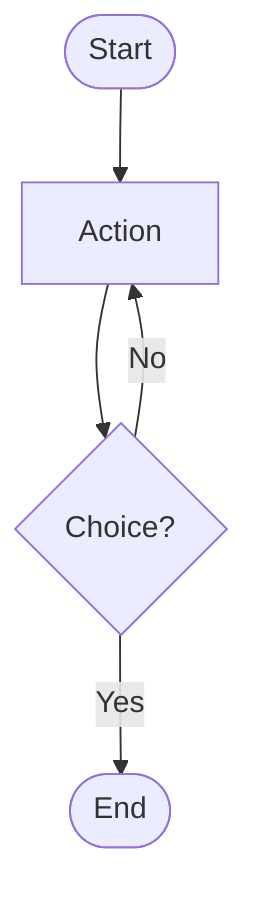
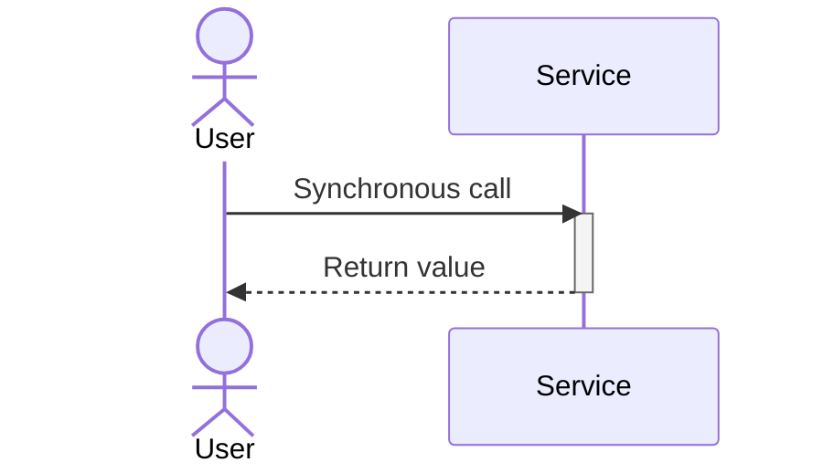
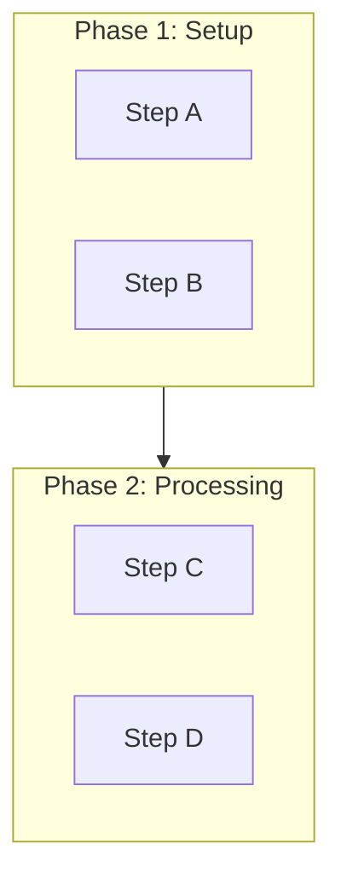
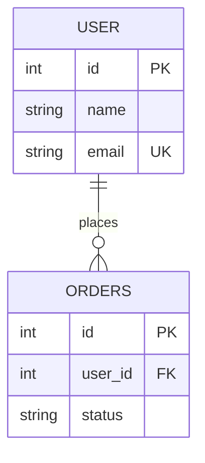
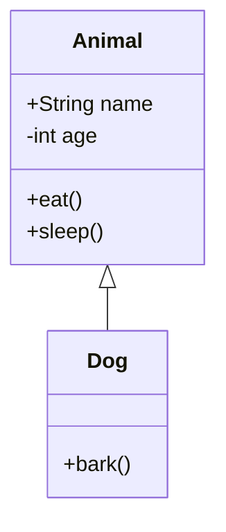
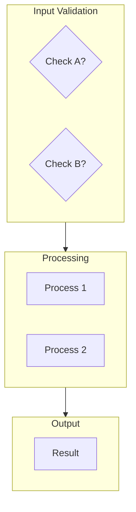

# Claude Code Development Guide

This guide is for developers using Claude Code to work with the Mermaid.js sample project.

## Project Overview

The Mermaid.js sample project is a comprehensive collection of diagram examples showcasing various Mermaid diagram types and patterns. Each sample is self-contained in an HTML file with embedded explanations and code snippets.

## Project Structure

```
mermaidjs-sample/
├── index.html                 # Main navigation page
├── samples/
│   ├── 01-basic/             # 3 files - fundamental diagrams
│   ├── 02-intermediate/      # 4 files - real-world patterns
│   ├── 03-advanced/          # 5 files - specialized diagrams
│   └── 04-complex/           # 4 files - large diagrams
├── styles/main.css           # Shared styling
├── utils/mermaid-config.js   # Configuration helpers
└── package.json              # Project metadata
```

## Working with Samples

### Sample HTML Template

Each sample follows this structure:

```html
<!DOCTYPE html>
<html lang="en">
<head>
    <meta charset="UTF-8">
    <meta name="viewport" content="width=device-width, initial-scale=1.0">
    <title>Diagram Type - Mermaid.js Sample</title>
    <link rel="stylesheet" href="../../styles/main.css">
    <script src="https://cdn.jsdelivr.net/npm/mermaid/dist/mermaid.min.js"></script>
    <script>
        mermaid.initialize({ startOnLoad: true, theme: 'default', securityLevel: 'loose' });
    </script>
</head>
<body>
    <div class="container">
        <a href="../../index.html" class="back-link">Home</a>
        <header>
            <h1>Diagram Title</h1>
            <p>Brief description</p>
        </header>
        <main>
            <div class="sample-container">
                <!-- Info and code on left -->
                <div class="sample-info">
                    <h2>Use Case Title</h2>
                    <p class="description">Full description...</p>
                    <div class="key-features">
                        <h3>Key Features</h3>
                        <ul>...</ul>
                    </div>
                    <div class="key-features">
                        <h3>Mermaid Syntax</h3>
                        <div class="sample-code">
                            <pre>diagram code here</pre>
                        </div>
                    </div>
                </div>
                <!-- Diagram on right -->
                <div class="diagram-container">
                    <div class="mermaid">
                        actual mermaid diagram
                    </div>
                </div>
            </div>
        </main>
        <footer>
            <p>Mermaid.js Sample Project | <a href="https://mermaid.js.org" target="_blank">Mermaid Documentation</a></p>
        </footer>
    </div>
</body>
</html>
```

### Key HTML Components

1. **Breadcrumb Navigation**: `<a href="../../index.html" class="back-link">Home</a>`
   - Allows navigation back to the main index

2. **Header Section**: Diagram title and brief description
   - Keep descriptions concise (1-2 sentences)
   - Title should be descriptive (e.g., "User-Server Communication" not just "Sequence Diagram")

3. **Two-Column Layout**: `sample-container` grid
   - Left: Information, description, key features, code example
   - Right: The actual rendered diagram

4. **Diagram Container**: `diagram-container` with `.mermaid` div
   - Contains the actual Mermaid diagram syntax
   - Mermaid.js automatically finds and renders `.mermaid` divs

## Mermaid Syntax Patterns

### Basic Flowchart


**Syntax Tips:**
- `flowchart TD` = Top-Down direction (also: `LR`, `RL`, `BT`)
- `(["Rounded"])` = Terminal/start-end nodes
- `["Rectangle"]` = Process nodes
- `{"Diamond"}` = Decision nodes
- `-->` = Arrow connection
- `-->|Label|` = Labeled connection

### Sequence Diagram


**Syntax Tips:**
- `actor` = Human actor (different styling)
- `participant` = System/service
- `->>` = Synchronous message (solid arrow)
- `-->>` = Return/response (dashed arrow)
- `activate/deactivate` = Lifeline activation boxes

### Subgraphs for Organization


**Syntax Tips:**
- Subgraphs automatically group nodes
- Use descriptive subgraph names in quotes
- Subgraphs can be nested (avoid too much nesting)
- Great for organizing large diagrams

### Entity-Relationship


**Syntax Tips:**
- `||--o{` = One-to-many relationship
- `||--||` = One-to-one
- `o{--o{` = Many-to-many
- `PK` = Primary Key
- `FK` = Foreign Key
- `UK` = Unique Key

### Class Diagram


**Syntax Tips:**
- `+` = Public visibility
- `-` = Private visibility
- `#` = Protected visibility
- `<|--` = Inheritance
- `*--` = Composition
- `o--` = Aggregation

## Adding New Samples

### Step 1: Create the HTML File
1. Choose the appropriate category directory (`01-basic`, `02-intermediate`, etc.)
2. Create a new `.html` file with descriptive name (e.g., `state-diagram.html`)
3. Copy the template structure from an existing sample
4. Customize the header, description, and key features

### Step 2: Add the Mermaid Diagram
1. Write your Mermaid syntax in the `<div class="mermaid">` section
2. Include a code example in the `<pre>` tag within the "Mermaid Syntax" section
3. Test the diagram renders correctly by opening the file in browser

### Step 3: Add Navigation Link
1. Edit `index.html`
2. Find the appropriate section (Basic/Intermediate/Advanced/Complex)
3. Add a new `nav-section` div with:
   - Diagram title
   - Brief description
   - Link to the HTML file
   - Learning summary

### Step 4: Test and Validate
1. Open the sample in multiple browsers
2. Test responsive behavior (resize browser window)
3. Verify links work correctly
4. Check dark mode toggle works with the diagram

## Layout Strategies for Complex Diagrams

### For Large Flowcharts (30+ nodes)
1. **Use subgraphs**: Organize into logical phases
2. **Hierarchical flow**: Keep main flow top-to-bottom
3. **Group related decisions**: Keep related logic together
4. **Error paths separate**: Show error handling in distinct areas
5. **Abbreviate labels**: Full descriptions in accompanying text

Example structure:


### For Microservices Diagrams
1. **Layered organization**: API Gateway → Services → Data Layer → External
2. **Group by domain**: Related services together
3. **Use emojis**: Quick visual identification (🔐 Auth, 📦 Product, etc.)
4. **Show integration boundaries**: External services distinguished visually

### For Dependency Graphs
1. **Cluster by category**: Build tools, utilities, frameworks, testing
2. **Hierarchy by dependency**: Core dependencies at bottom
3. **Highlight shared dependencies**: Show packages used by many others
4. **Limit depth**: Don't show transitive dependencies of transitive deps

## CSS and Styling

### Using Main.css Classes

**Container classes:**
- `.container` - Main content wrapper (max-width: 1200px)
- `.sample-container` - Two-column grid layout
- `.diagram-container` - Diagram display area

**Color variables** (in `:root`):
- `--primary-bg` - Main background
- `--primary-text` - Main text color
- `--accent-color` - Links and highlights
- `--secondary-text` - Muted text

**Dark mode support:**
The CSS automatically applies dark theme when `body.dark-mode` class is added.

### Customizing Diagram Container

Default diagram container is 400px min-height. For complex diagrams:
```html
<div class="diagram-container" style="min-height: 600px; max-height: 800px;">
    <div class="mermaid">
        <!-- diagram here -->
    </div>
</div>
```

## Configuration

### Mermaid Initialize Options

Common options in the `<script>` tag:

```javascript
mermaid.initialize({
    startOnLoad: true,           // Auto-render diagrams
    theme: 'default',            // Theme (default, dark, forest, neutral)
    securityLevel: 'loose',      // Allow HTML in labels
    flowchart: {
        useMaxWidth: true,       // Responsive sizing
        htmlLabels: true,        // Allow HTML in labels
        curve: 'linear'          // Line style
    }
});
```

### For Different Diagram Types

**Sequence Diagrams:**
```javascript
sequence: {
    mirrorActors: true,          // Centered actors
    useMaxWidth: true
}
```

**Flowcharts (Large):**
```javascript
flowchart: {
    useMaxWidth: true,
    htmlLabels: true,
    defaultRenderer: 'dagre-d3'  // Better layout for large graphs
}
```

## Common Challenges and Solutions

### Issue: Diagram not rendering
**Solution:** Check that:
- The `.mermaid` class is on the container div
- Mermaid.js script is loaded (check browser console)
- Syntax is valid (use mermaid.live for testing)

### Issue: Diagram too large or cut off
**Solution:**
- Increase container height: `min-height: 800px`
- Use `useMaxWidth: true` in config
- Simplify the diagram or split into multiple diagrams

### Issue: Text labels too long
**Solution:**
- Use abbreviations or short labels in diagram
- Put full explanation in the description text
- Use line breaks in labels: `"Label line 1\nLabel line 2"`

### Issue: Too many nodes, layout is messy
**Solution:**
- Use subgraphs to organize logically
- Split into multiple related diagrams
- Consider a higher-level abstraction
- Use different diagram type (e.g., mindmap instead of flowchart)

### Issue: Performance slow on large diagram
**Solution:**
- Simplify the diagram (fewer nodes)
- Break into multiple diagrams
- Use a lower theme complexity
- Test in a faster browser (Chrome generally fastest)

## Development Workflow

### Creating a new sample:
1. Copy an existing sample file as template
2. Edit the title, description, and key features
3. Replace the mermaid diagram syntax
4. Update the code example in the "Mermaid Syntax" section
5. Test by opening in browser
6. Add link to index.html
7. Test the navigation link

### Quick testing:
```bash
# Start local server
npm start
# or
python3 -m http.server 8000

# Open browser to http://localhost:8000
# Navigate to your sample
# Test on mobile viewport (Dev Tools)
```

### Before committing:
- ✅ Diagram renders without errors
- ✅ Responsive (test at different widths)
- ✅ Links work (back to home, to next samples)
- ✅ Code example matches diagram
- ✅ Description is clear and concise
- ✅ Dark mode still looks good

## Useful Resources

### Mermaid.js Official Resources
- [Mermaid.js Website](https://mermaid.js.org)
- [Live Editor](https://mermaid.live) - Test syntax here
- [GitHub](https://github.com/mermaid-js/mermaid)
- [Getting Started](https://mermaid.js.org/intro/)

### Diagram-Specific Docs
- [Flowchart Syntax](https://mermaid.js.org/syntax/flowchart.html)
- [Sequence Diagram Syntax](https://mermaid.js.org/syntax/sequenceDiagram.html)
- [Class Diagram Syntax](https://mermaid.js.org/syntax/classDiagram.html)
- [State Diagram Syntax](https://mermaid.js.org/syntax/stateDiagram.html)
- [Entity-Relationship Syntax](https://mermaid.js.org/syntax/entityRelationshipDiagram.html)

### Related Tools
- [PlantUML](https://plantuml.com/) - Another diagram tool
- [Graphviz](https://graphviz.org/) - Graph visualization
- [Excalidraw](https://excalidraw.com/) - Hand-drawn diagrams

## Tips for Effective Samples

1. **Progressive Complexity**: Start with simple, clear examples
2. **Real-World Relevance**: Use actual use cases people recognize
3. **Clear Descriptions**: Explain what the diagram shows and why
4. **Syntax Examples**: Include the actual Mermaid code
5. **Key Learnings**: Highlight what the sample demonstrates
6. **Good Organization**: Use subgraphs and logical grouping
7. **Accessible Design**: Works in light and dark modes
8. **Responsive Layout**: Looks good at any screen size

## Future Enhancement Ideas

- Add export functionality (PNG, SVG)
- Interactive diagram editor
- Search/filter by diagram type or use case
- Diagram comparison tool
- Performance metrics for complex diagrams
- Multi-language support
- Printable versions
- Customizable templates

---

**Questions?** Check the official Mermaid.js documentation or the GitHub discussions for community support.
