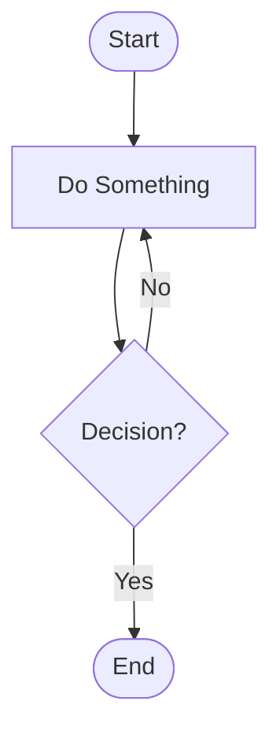
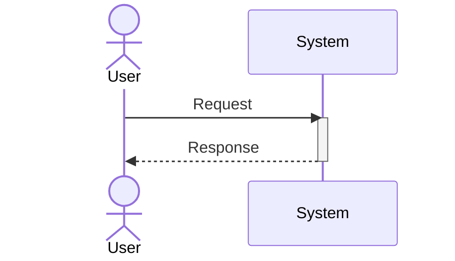
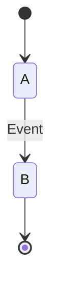
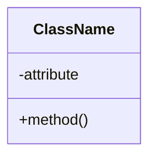
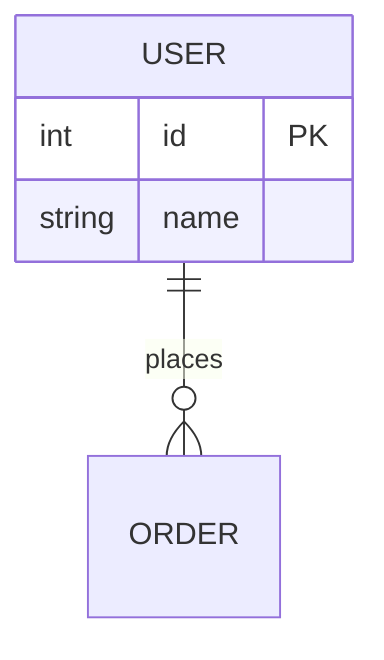
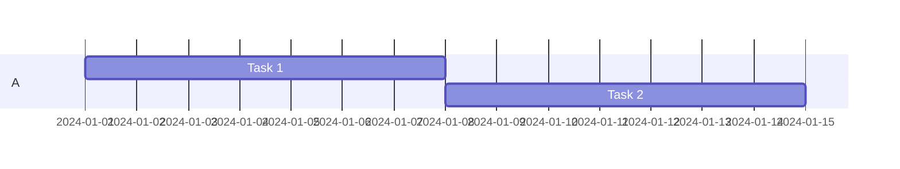

# Mermaid.js Diagram Samples

A comprehensive collection of Mermaid.js diagram examples showcasing all diagram types from basic to advanced use cases, with emphasis on complex diagrams, layout strategies, and real-world scenarios.

## Overview

This project demonstrates how to use Mermaid.js for creating:
- **Basic diagrams**: Flowcharts, sequence diagrams, state machines
- **Intermediate diagrams**: Class diagrams, ERD, Gantt charts, pie charts
- **Advanced diagrams**: C4 systems, git graphs, architecture, mindmaps, user journeys
- **Complex diagrams**: Large flowcharts, microservices, dependencies, multi-layer systems

Each sample is a markdown file with embedded Mermaid diagrams, viewable directly on GitHub or through the web viewer. The markdown files are the single source of truth - no duplication between GitHub and the web interface.

## Quick Start

### Prerequisites
- A modern web browser (Chrome, Firefox, Safari, Edge)
- Python 3 (for local server, usually pre-installed)
- No build step required - all files are static HTML/CSS/JavaScript

### Running Locally

**Option 1: Using Python (Recommended)**
```bash
python3 -m http.server 8000
```

**Option 2: Using Node.js**
```bash
npx http-server
```

**Option 3: Direct File Access**
Simply open `index.html` in your web browser (no server needed):
```bash
# macOS/Linux
open index.html

# Windows
start index.html
```

Then navigate to `http://localhost:8000` or `http://localhost:8080`

### Viewing on GitHub
All markdown samples render automatically with Mermaid diagrams on GitHub. Just browse to the `samples/` directory in this repository!

## Project Structure

```
mermaidjs-sample/
├── index.html                      # Main landing page with navigation
├── sample-viewer.html              # Generic viewer for markdown samples
├── README.md                       # This file
├── CLAUDE.md                       # Development guide
├── styles/
│   └── main.css                   # Shared styling (dark/light mode, responsive)
├── samples/
│   ├── 01-basic/                  # Fundamental diagram types
│   │   ├── flowchart.md
│   │   ├── sequence.md
│   │   └── state.md
│   ├── 02-intermediate/           # Real-world applicable diagrams
│   │   ├── class-diagram.md
│   │   ├── entity-relationship.md
│   │   ├── gantt-chart.md
│   │   └── pie-chart.md
│   ├── 03-advanced/               # Specialized/architectural diagrams
│   │   ├── c4-system.md
│   │   ├── git-graph.md
│   │   ├── architecture.md
│   │   ├── mindmap.md
│   │   └── user-journey.md
│   └── 04-complex/                # Large diagrams and optimization
│       ├── large-flowchart.md
│       ├── microservices.md
│       ├── dependency-graph.md
│       └── multi-layer-architecture.md
└── utils/
    └── mermaid-config.js          # Configuration and helper functions
```

## Key Features: Markdown-First Architecture

- **Single Source of Truth**: All samples are stored as `.md` files
- **GitHub Native**: Markdown files render automatically with Mermaid diagrams on GitHub
- **No Duplication**: Same file viewed on GitHub or via the web viewer
- **Easy Maintenance**: Edit markdown once, updates everywhere
- **Portable**: Works with any markdown viewer or platform

## Diagram Categories

### Basic Samples (3 diagrams)
Perfect for learning Mermaid fundamentals:
- **Flowchart**: Decision trees and process flows
- **Sequence Diagram**: Two-actor message passing
- **State Diagram**: State machines and lifecycles

### Intermediate Samples (4 diagrams)
Real-world applicable examples:
- **Class Diagram**: OOP design patterns
- **Entity-Relationship**: Database schemas
- **Gantt Chart**: Project timelines
- **Pie Chart**: Data distribution

### Advanced Samples (5 diagrams)
Specialized architectural diagrams:
- **C4 System Diagram**: System context and architecture
- **Git Graph**: Version control workflows
- **Architecture Diagram**: Microservices and components
- **Mindmap**: Knowledge organization
- **User Journey**: Customer experience flows

### Complex Samples (4 diagrams)
Demonstrating handling of large, complex diagrams:
- **Large Flowchart**: 30+ nodes with subgraph organization
- **Microservices**: 15+ interconnected services
- **Dependency Graph**: 40+ packages with relationships
- **Multi-Layer Architecture**: Enterprise system design

## Key Features

### Layout Optimization Strategies
The complex samples demonstrate several strategies for handling large diagrams:

1. **Subgraph Grouping**: Logical organization of related nodes
   ```mermaid
   subgraph Phase["Processing Phase"]
       A[Step 1]
       B[Step 2]
   end
   ```

2. **Hierarchical Arrangement**: Top-down flow for readability
3. **Node Clustering**: Related items grouped together
4. **Label Management**: Concise labels with long descriptions in separate text
5. **Multiple Decision Paths**: Clear routing for different scenarios

### Styling and Theming
- Dark/light mode toggle (see theme button on home page)
- Responsive CSS that adapts to different screen sizes
- Clean, minimal design focusing on diagram clarity

### Browser Compatibility
- Works in all modern browsers
- Responsive design for mobile viewing
- SVG-based rendering ensures crisp display at any size

## How to Use

### Viewing Samples
1. Open `index.html` in your browser
2. Navigate to the diagram category you're interested in
3. Click "View Diagram" to see the full sample with code

### Learning Path
Recommended progression for learning Mermaid.js:
1. Start with **Basic** samples to understand syntax
2. Move to **Intermediate** samples for real-world patterns
3. Explore **Advanced** samples for specialized use cases
4. Study **Complex** samples for layout and optimization strategies

### Modifying Samples
All HTML files can be edited to experiment with Mermaid syntax:
1. Edit the HTML file in your text editor
2. Save the file
3. Refresh your browser to see changes
4. The Mermaid code is in the `<div class="mermaid">` tags

## Common Diagram Types Reference

### Flowchart (Top-Down)


### Sequence Diagram


### State Diagram


### Class Diagram


### Entity-Relationship


### Gantt Chart


## Tips and Best Practices

### Design for Clarity
- ✅ Use descriptive labels for all elements
- ✅ Limit nodes per diagram (aim for <30 for flowcharts)
- ✅ Group related items with subgraphs
- ✅ Use consistent naming conventions

### Performance
- ✅ Use subgraphs to organize large diagrams
- ✅ Keep label text concise
- ✅ Test rendering in the browser you'll use
- ✅ Consider breaking very large diagrams into multiple sections

### Common Pitfalls
- ❌ Too many decision branches making diagram hard to follow
- ❌ Inconsistent naming (mixing camelCase, snake_case, etc.)
- ❌ Overly complex relationships that should be simplified
- ❌ Very long labels that break the layout

### Optimization for Complex Diagrams
1. **Use subgraphs**: Group related nodes logically
2. **Abbreviate labels**: Full descriptions can be in accompanying text
3. **Limit depth**: Avoid deeply nested subgraphs
4. **Test responsiveness**: Check how diagrams look on different screen sizes
5. **Consider splitting**: Very complex diagrams may work better as multiple simpler diagrams

## Styling

### CSS Classes
The main styling is in `styles/main.css`:
- `.diagram-container`: Container for mermaid diagrams
- `.sample-info`: Information section
- `.nav-grid`: Navigation grid layout
- `--primary-bg`, `--primary-text`: CSS variables for theming

### Dark Mode
Click the theme toggle button (moon icon) in the bottom-right to switch themes. Your preference is saved in localStorage.

## Mermaid Configuration

The project uses sensible defaults defined in `utils/mermaid-config.js`:
- `securityLevel: 'loose'`: Allows full HTML in labels
- `theme: 'default'`: Clean, readable theme
- `useMaxWidth: true`: Diagrams scale to container

You can customize these settings by editing the configuration in each HTML file.

## Resources

### Official Documentation
- [Mermaid.js Official Site](https://mermaid.js.org)
- [Getting Started Guide](https://mermaid.js.org/intro/)
- [Syntax Documentation](https://mermaid.js.org/syntax/flowchart.html)

### Community
- [GitHub Repository](https://github.com/mermaid-js/mermaid)
- [GitHub Discussions](https://github.com/mermaid-js/mermaid/discussions)
- [Live Editor](https://mermaid.live)

## Contributing

To add new samples to this project:

1. **Create a new HTML file** in the appropriate `samples/XX-category/` directory
2. **Follow the template structure** from existing samples:
   - Basic styling with the shared CSS
   - Breadcrumb navigation back to home
   - Sample info with description and key features
   - Diagram container with mermaid diagram
   - Code snippet showing the syntax
3. **Add navigation link** in `index.html` with description
4. **Test in browser** to ensure the diagram renders correctly

See `CLAUDE.md` for detailed development guidelines.

## Browser Support

- Chrome/Edge: ✅ Full support
- Firefox: ✅ Full support
- Safari: ✅ Full support
- IE11: ⚠️ Not tested (Mermaid.js support may be limited)

## Performance Notes

- Diagrams render on the client-side (browser-based)
- Larger diagrams (40+ nodes) may take a moment to render
- The layout algorithm optimizes for clarity over speed
- SVG output ensures crisp rendering at any zoom level

## License

This sample project is provided as-is for educational purposes. Mermaid.js itself is licensed under the MIT License.

## Troubleshooting

### Diagram not rendering?
- Check browser console for errors (F12 → Console tab)
- Ensure JavaScript is enabled
- Try refreshing the page
- Check that Mermaid.js CDN is accessible

### Diagram looks wrong?
- Clear browser cache and refresh
- Try a different browser
- Check the Mermaid syntax is valid
- Ensure no special characters need escaping

### Responsive issues?
- Zoom browser to different levels to test scaling
- Test on mobile device or use browser dev tools device emulation
- Check the CSS media queries in `main.css`

## Quick Tips for Specific Diagrams

### Flowcharts
- Use descriptive node names
- Keep decision nodes simple (yes/no branching)
- Use subgraphs to show phases

### Sequence Diagrams
- Limit to 3-4 actors for clarity
- Show both directions of communication
- Use activation boxes to show timing

### Gantt Charts
- Use consistent date formats
- Mark dependencies clearly
- Include milestones for key dates

### Class Diagrams
- Show inheritance relationships clearly
- Include key methods and properties
- Use standard UML visibility markers (+, -, #)

---

**Happy diagramming!** 🎨
