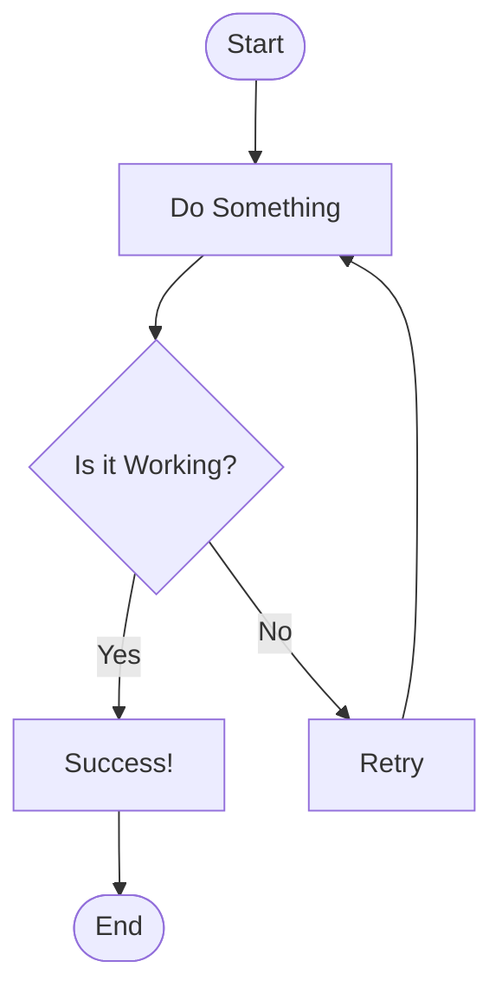

# Basic Flowchart

A simple decision tree showing basic process flow with start/end points, actions, and decision branches.

## Use Case: Decision Tree Process

This flowchart demonstrates a simple decision-making process. It shows how to use basic flowchart elements: start/end nodes (rounded rectangles), process nodes (rectangles), decision nodes (diamonds), and connecting arrows with labels.

### Key Features
- Start and end terminals
- Process steps
- Decision points with yes/no branches
- Clear flow direction
- Labeled connections

## Diagram

## Concepts Demonstrated

**Node Types:**
- `(["text"])` - Rounded rectangle (start/end)
- `["text"]` - Rectangle (process)
- `{"text"}` - Diamond (decision)

**Connections:**
- `-->` - Basic arrow
- `-->|Label|` - Labeled arrow
- Can be chained: `A --> B --> C`

## Learning Tips

Start with simple flowcharts and gradually add complexity. Use meaningful names for nodes that clearly describe what happens. Group related logic together.
