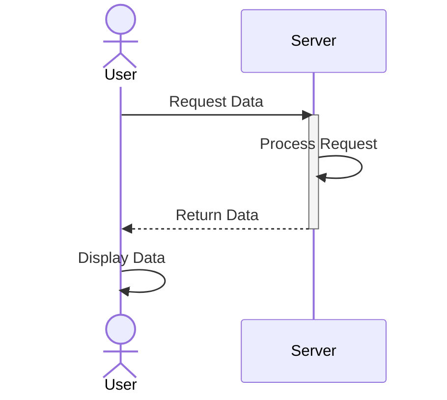

# Basic Sequence Diagram

A simple two-actor interaction showing message flow and communication patterns over time.

## Use Case: User-Server Communication

This sequence diagram illustrates a basic interaction between a user (client) and a server. It shows how actors exchange messages over time, demonstrating request-response patterns commonly found in web applications.

### Key Features
- Actors (participants) shown on horizontal axis
- Time flowing downward
- Synchronous messages (solid arrows)
- Return/response messages (dashed arrows)
- Activation boxes showing when actors are busy

## Diagram

## Concepts Demonstrated

**Participants:**
- `actor User` - Human participant (special styling)
- `participant Server` - System/service participant

**Messages:**
- `->>` - Synchronous call (solid arrow)
- `-->>` - Return/response (dashed arrow)
- `activate` - Start activation box
- `deactivate` - End activation box

**Common Patterns:**
- Request-response cycle
- Self-calls for internal processing
- Multiple sequential interactions

## Learning Tips

Sequence diagrams are great for showing interactions between systems. Keep the number of participants small (2-4) for clarity. Use meaningful message labels that describe what data is being passed.
