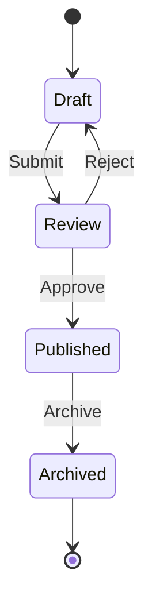

# Basic State Diagram

A simple state machine showing object lifecycle and transitions between states based on events.

## Use Case: Document Workflow States

This state diagram demonstrates a simple state machine for document management. It shows how an object transitions between different states based on events, illustrating the complete lifecycle of a document from creation to archive.

### Key Features
- States represented as rounded rectangles
- Transitions labeled with triggering events
- Initial state (filled circle `[*]`)
- Final state (double circle `[*]`)
- Directional flow between states

## Diagram

## Concepts Demonstrated

**State Syntax:**
- `[*]` - Initial or final state
- `State1 --> State2` - Transition
- `State1 --> State2: Event` - Labeled transition

**State Machine Pattern:**
- Each state has specific meaning
- Transitions only allowed between certain states
- Events trigger transitions
- Clear entry and exit points

## Learning Tips

State diagrams are excellent for modeling lifecycles and workflows. Think about what states an object can be in and what events cause transitions between them. Use descriptive event labels (verbs like "Submit", "Approve", "Reject").
