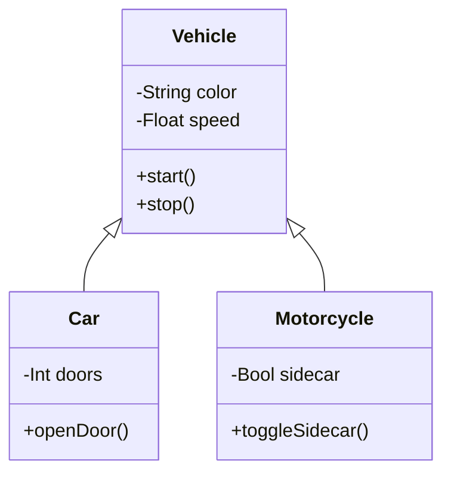

# Class Diagram

Object-oriented design showing inheritance and composition relationships between classes with attributes and methods.

## Use Case: Vehicle Inheritance Hierarchy

This class diagram demonstrates object-oriented design patterns including inheritance, composition, and method/property definitions. It shows a vehicle management system with an abstract base class and concrete implementations.

### Key Features
- Classes with attributes and methods
- Inheritance relationships (is-a relationships)
- Composition relationships (has-a relationships)
- Visibility modifiers (+, -, #)
- Method signatures with return types

## Diagram

## Concepts Demonstrated

**Visibility Modifiers:**
- `+` - Public
- `-` - Private
- `#` - Protected
- `~` - Package (internal)

**Relationships:**
- `<|--` - Inheritance (is-a)
- `*--` - Composition (owns)
- `o--` - Aggregation (has)
- `-->` - Association (uses)

**Method/Property Syntax:**
- `type name` - Property
- `returnType method()` - Method

## Learning Tips

Use class diagrams to design object hierarchies before coding. Show the relationships between classes clearly. Include only the most important methods and properties to keep the diagram readable. Think about what data and behavior belongs in each class.
