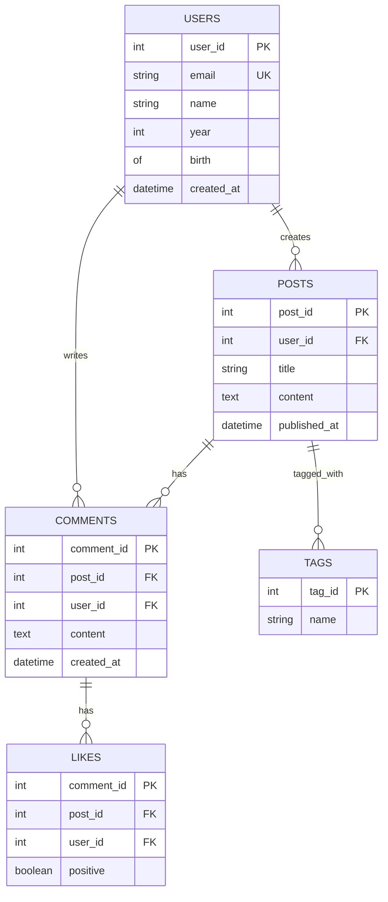

# Entity-Relationship Diagram

Database schema design showing tables, columns, and relationships between entities.

## Use Case: Blog Database Schema

This entity-relationship diagram shows the structure of a simple blog database. It demonstrates how tables are organized, what columns they contain, and how entities relate to each other through foreign keys (one-to-many and many-to-many relationships).

### Key Features
- Entity definitions with attributes
- Primary keys (PK) and foreign keys (FK)
- Data type specifications
- One-to-many relationships
- Many-to-many relationships via junction tables

## Diagram

## Concepts Demonstrated

**Key Types:**
- `PK` - Primary Key (unique identifier)
- `FK` - Foreign Key (reference to another table)
- `UK` - Unique Key (must be unique but not primary)

**Relationship Symbols:**
- `||` - One
- `o{` - Many
- `||--o{` - One-to-many (one user creates many posts)
- `||--|{` - One-to-one
- `o{--o{` - Many-to-many

**Attributes:**
- Column name and type
- Key designation (PK, FK, UK)

## Learning Tips

Think about your data entities and what information you need to store. Identify the relationships between entities. Use primary keys to uniquely identify records. Use foreign keys to connect tables. Normalize your schema to reduce redundancy.
