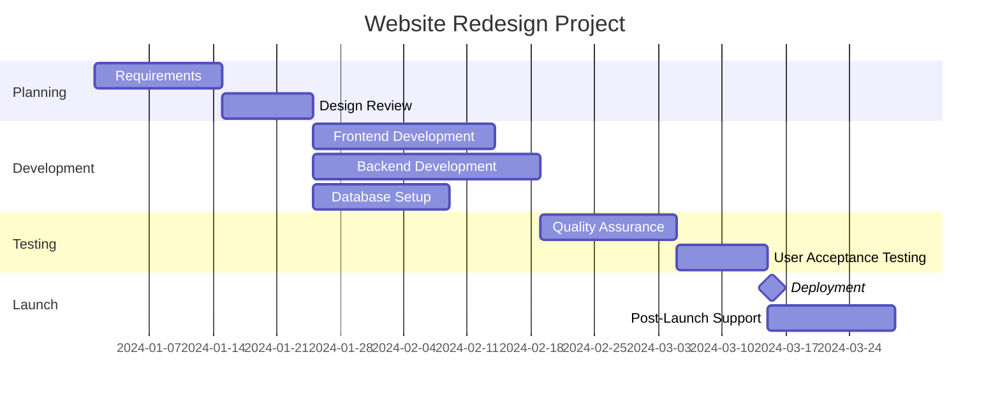

# Gantt Chart

Project timeline visualization with task scheduling, dependencies, and milestones.

## Use Case: Website Redesign Project

This Gantt chart visualizes a software project timeline showing tasks, their duration, dependencies, and critical path. It's useful for project planning, resource allocation, and tracking progress across multiple phases.

### Key Features
- Time-based task scheduling
- Task dependencies (one task depends on another)
- Milestone markers for key dates
- Parallel and sequential tasks
- Duration visualization

## Diagram

## Concepts Demonstrated

**Task Definition:**
- `taskId, status, date, duration` or `taskId, status, after otherTask, duration`
- `:done` - Completed task
- `:active` - Current task
- `:crit` - Critical task (red)
- `:milestone` - Milestone marker

**Date Formats:**
- `YYYY-MM-DD` - Specific date
- `after taskId` - After another task completes
- `30d` - 30 days duration

**Sections:**
- Organize tasks into logical phases
- Show parallel workflows

## Learning Tips

Gantt charts are ideal for project management and planning. Break projects into logical phases. Show dependencies between tasks. Use milestones to mark important dates. Consider resource constraints when scheduling tasks.
