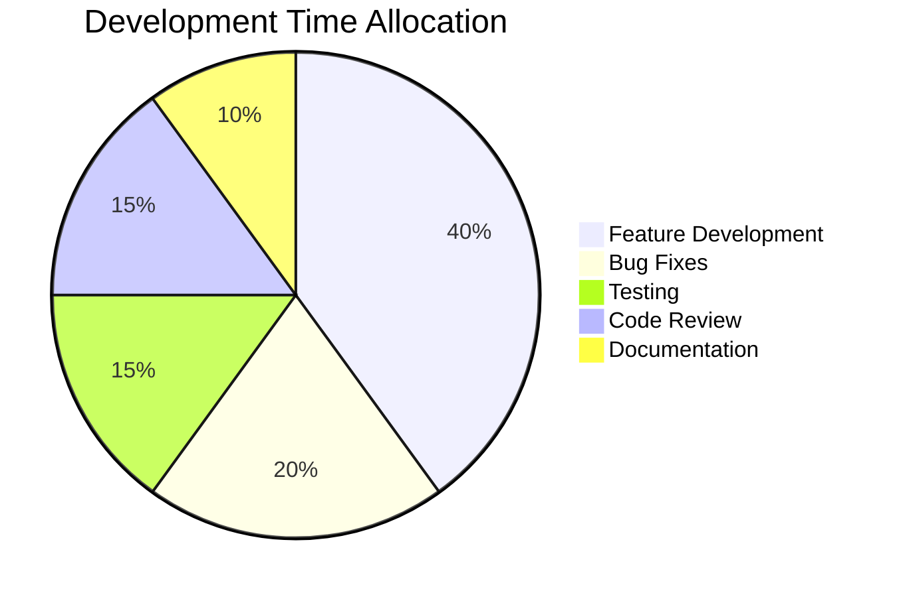

# Pie Chart

Data distribution visualization showing proportions and percentages across categories.

## Use Case: Development Time Allocation

This pie chart demonstrates how to visualize proportional data. It shows the breakdown of development effort across different activities in a typical software project, making it easy to see how resources are distributed.

### Key Features
- Labeled data segments
- Proportional visualization
- Percentage values automatically calculated
- Clear category breakdown
- Simple data representation

## Diagram

## Concepts Demonstrated

**Syntax:**
- `pie title Chart Title` - Start pie chart with title
- `"Label" : value` - Category and value
- Values are proportional (40 out of 100 = 40%)

**Use Cases:**
- Budget allocation
- Time tracking
- Market share
- Survey results
- Resource distribution

## Learning Tips

Pie charts work best with 3-6 categories. Too many segments become hard to read. The values should add up to something meaningful (100 for percentages, total hours, etc.). Use descriptive labels that are easy to understand at a glance.
