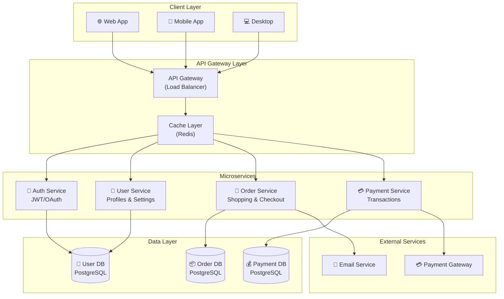

# System Architecture

Component-based system design showing service layers and dependencies.

## Use Case: Microservices Architecture

This architecture diagram shows how different services and components interact in a modern application. It visualizes the layered structure with presentation, business logic, and data layers, showing clear separation of concerns and service boundaries.

### Key Features
- Component grouping and organization
- Layered architecture representation
- Service interactions
- External integrations
- Data flow patterns

## Diagram

## Concepts Demonstrated

**Subgraphs:**
- Group related components
- Show logical layers
- Organize by responsibility

**Service Patterns:**
- API Gateway pattern - Single entry point
- Microservices - Independent services
- Caching - Performance optimization
- Database per service - Data isolation

**Relationships:**
- Client → Gateway → Services → Data
- Services call external systems
- Horizontal scaling at service level

## Learning Tips

Design systems with clear separation of concerns. Each service should have a single responsibility. Use an API gateway as the entry point. Cache frequently accessed data. Consider data consistency and transaction requirements. Design for scalability from the start.
