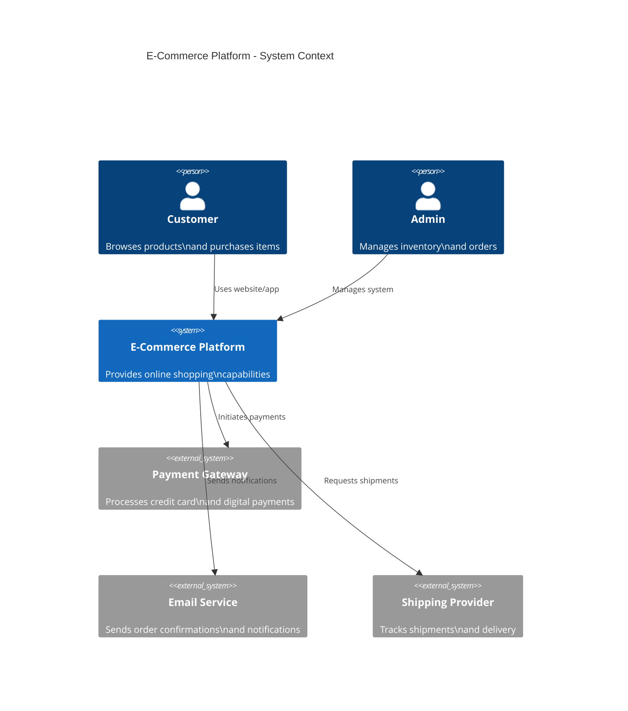

# C4 System Diagram

High-level system architecture showing context, actors, and external systems.

## Use Case: E-Commerce Platform Architecture

The C4 model provides four levels of abstraction for visualizing software systems. This diagram shows the System Context level - how your system fits into the broader environment, showing external users and systems it interacts with.

### Key Features
- System context overview
- External actors and systems
- High-level interactions
- System boundaries
- Relationship descriptions

## Diagram

## Concepts Demonstrated

**C4 Model Levels:**
1. **Context** (this diagram) - System as a black box, external interactions
2. **Container** - Major building blocks (web app, API, database)
3. **Component** - Internal structure of containers
4. **Code** - Classes, functions, modules

**Diagram Elements:**
- `Person()` - Human actor
- `System()` - Your system
- `System_Ext()` - External system
- `Rel()` - Relationship/interaction

## Learning Tips

Start with context diagrams to understand the big picture. Use clear, descriptive names for systems and relationships. Keep the context diagram simple - it should show what your system does at a high level. Use lower-level C4 diagrams to show more detail.
