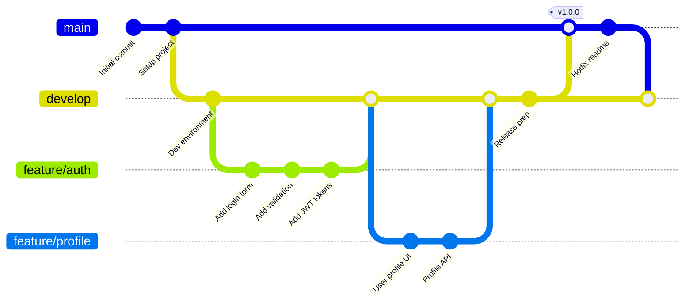

# Git Graph

Git branch history and merge workflow visualization.

## Use Case: Feature Development Workflow

This git graph visualizes a typical feature branch workflow showing commits, branches, and merges. It demonstrates how teams organize their development using branch strategies like Git Flow, making it easy to understand the project's version control history.

### Key Features
- Commit history visualization
- Branch creation and merging
- Tagged releases
- Parallel development streams
- Merge points

## Diagram

## Concepts Demonstrated

**Git Flow Strategy:**
- `main` branch - Production releases
- `develop` branch - Integration branch
- `feature/` branches - Feature development
- Merges back to develop when complete

**Diagram Commands:**
- `commit id: "message"` - Add commit
- `branch branchName` - Create branch
- `checkout branchName` - Switch branch
- `merge branchName` - Merge branch
- `tag: "tagName"` - Add version tag

## Learning Tips

Use consistent naming for branches (e.g., `feature/`, `bugfix/`, `release/`). Keep feature branches focused on single features. Merge back to develop frequently to avoid conflicts. Use tags for releases. Visualize your workflow to help team understand the development process.
