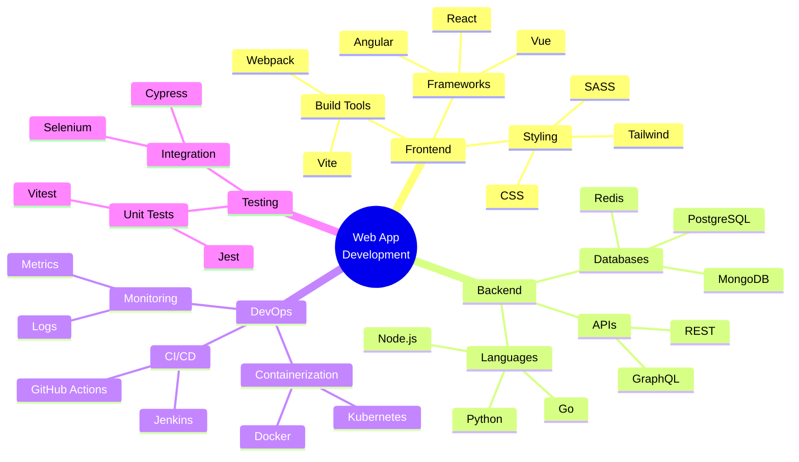

# Mindmap

Hierarchical knowledge map for brainstorming and information organization.

## Use Case: Web Application Development

Mindmaps are excellent for brainstorming, knowledge organization, and hierarchical information display. This example shows a complete web development project broken down into major categories, subcategories, and specific tasks, making it easy to understand the full scope.

### Key Features
- Hierarchical organization
- Central concept with branches
- Multi-level nesting (typically 3-4 levels)
- Easy visual scanning
- Natural brainstorming format

## Diagram

## Concepts Demonstrated

**Structure:**
- Central root node (double circles)
- Primary branches (main categories)
- Secondary branches (subcategories)
- Tertiary branches (specific items)

**Best Practices:**
- Limit to 4-5 primary branches
- Use 2-3 levels maximum
- Keep labels concise
- Arrange logically by category

**Use Cases:**
- Project planning
- Knowledge organization
- Requirements gathering
- Architecture design
- Learning topics

## Learning Tips

Start with a central concept and branch out into categories. Think hierarchically - group related items together. Use mindmaps for brainstorming before diving into detailed planning. Mindmaps are especially useful for complex projects with many moving parts.
