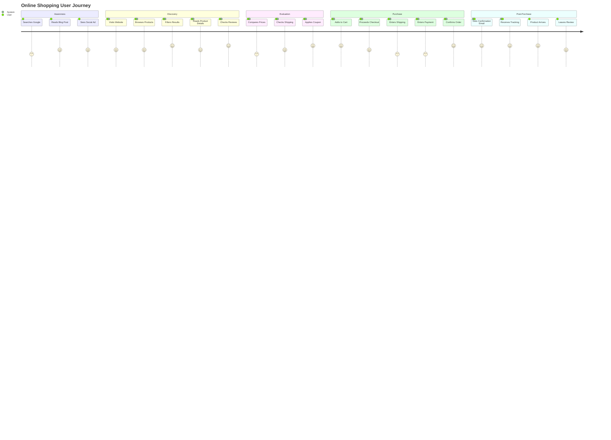

# User Journey

Customer experience flow showing touchpoints and interactions across stages.

## Use Case: Online Shopping Experience

User journey diagrams map out the complete path a user takes when interacting with your system. This example shows the various stages from awareness through post-purchase, including actions, touchpoints, and emotional states at each stage of the buying process.

### Key Features
- Journey stages/sections
- User actions and interactions
- Touchpoints and channels
- Emotional reactions (scored 1-5)
- Pain points and opportunities

## Diagram

## Concepts Demonstrated

**Journey Sections:**
- Break journey into phases
- Show progression from awareness to loyalty

**Tasks/Actions:**
- User: Actions the user takes
- System: System responses/interactions
- Both: Collaborative actions

**Emotional Scoring:**
- 1-5 scale indicating satisfaction
- Lower scores = pain points
- Higher scores = satisfactory experiences
- Identify where improvements needed

**Touchpoints:**
- All interactions with your system/brand
- Identify opportunities to improve experience

## Learning Tips

Map the entire customer journey, not just purchase. Identify pain points where users get frustrated. Look for opportunities to delight users. Consider all touchpoints - website, email, support, post-purchase. Use emotional scoring to prioritize improvements. Validate your journey map with actual users.
