# Dependency Graph

Large dependency network with 40+ packages showing relationships and shared utilities.

## Use Case: NPM Package Dependencies

This dependency graph represents a typical JavaScript application's dependency tree with 40+ packages. It visualizes complex interdependencies, shared dependencies, and potential circular references that commonly occur in modern software projects.

### Key Features
- 35+ packages showing complex relationships
- Shared dependencies across packages
- Hierarchical organization
- Category clustering
- Transitive dependencies

### Layout Strategies Demonstrated
- **Clustering**: Related packages grouped by category (Core, Build, Testing, etc.)
- **Hierarchy**: Top-level application depends on frameworks which depend on utilities
- **Shared Dependencies**: Multiple packages depending on common utilities
- **Circular References**: Shows potential dependency cycles
- **Version Information**: Indicates version compatibility across the graph

## Diagram

```mermaid
graph TB
    App["🚀 Application<br/>v1.0.0"]

    subgraph Framework["Framework & Core"]
        React["react<br/>18.2.0"]
        ReactDOM["react-dom<br/>18.2.0"]
        Redux["redux<br/>4.2.0"]
        ReactRedux["react-redux<br/>8.1.0"]
        Router["react-router<br/>6.8.0"]
    end

    subgraph Build["Build & Bundling"]
        Webpack["webpack<br/>5.88.0"]
        Babel["@babel/core<br/>7.22.0"]
        BabelLoader["babel-loader<br/>9.1.0"]
        Typescript["typescript<br/>5.0.0"]
        ESLint["eslint<br/>8.43.0"]
    end

    subgraph Testing["Testing"]
        Jest["jest<br/>29.5.0"]
        RTL["@testing-library/react<br/>14.0.0"]
        Vitest["vitest<br/>0.32.0"]
        Enzyme["enzyme<br/>3.11.0"]
    end

    subgraph Utilities["Utilities & Helpers"]
        Lodash["lodash<br/>4.17.21"]
        Axios["axios<br/>1.4.0"]
        DayJS["dayjs<br/>1.11.0"]
        UUID["uuid<br/>9.0.0"]
        Zustand["zustand<br/>4.3.0"]
    end

    subgraph Server["Server & API"]
        Express["express<br/>4.18.0"]
        NodeFetch["node-fetch<br/>3.3.0"]
        CORS["cors<br/>2.8.0"]
        Helmet["helmet<br/>7.0.0"]
    end

    subgraph Database["Database Drivers"]
        PG["pg<br/>8.10.0"]
        MongoDB["mongodb<br/>5.7.0"]
        Redis["redis<br/>4.6.0"]
    end

    Core["core-js<br/>3.30.0"]
    Regenerator["regenerator-runtime<br/>0.13.0"]
    Symbol["symbol.asynciterator<br/>1.0.0"]

    App --> React
    App --> Redux
    App --> Router
    App --> Webpack
    App --> Jest
    App --> Axios
    App --> Express

    React --> ReactDOM
    React --> Core
    ReactDOM --> Core

    Redux --> Regenerator

    ReactRedux --> React
    ReactRedux --> Redux

    Router --> React
    Router --> Regenerator

    Webpack --> Babel
    Webpack --> Typescript

    Babel --> BabelLoader
    Babel --> Core
    Babel --> Regenerator

    ESLint --> Typescript

    Jest --> Regenerator
    Jest --> Core

    RTL --> React
    RTL --> Jest

    Vitest --> Core

    Enzyme --> React

    Axios --> Core
    Axios --> Symbol

    DayJS --> Core

    UUID --> Core

    Zustand --> React

    Express --> CORS
    Express --> Helmet
    Express --> Core

    NodeFetch --> Symbol
    NodeFetch --> Regenerator

    PG --> Core
    MongoDB --> Core
    Redis --> Core

    Lodash --> Core
```

## Dependency Analysis

**Total Packages**: 35+ | **Top-level Dependencies**: 7 | **Transitive Dependencies**: 25+ | **Shared Utilities**: core-js, regenerator-runtime

This graph shows how modern JavaScript projects have complex dependency trees. Many packages share common dependencies (like core-js for polyfills), which is efficient but can create challenges with version conflicts.

## Learning Tips

Regularly audit dependencies to reduce bloat. Watch for circular dependencies which can cause issues. Keep dependencies up-to-date for security. Monitor transitive dependencies through your main dependencies. Use lock files (package-lock.json) to ensure consistent versions across environments.
