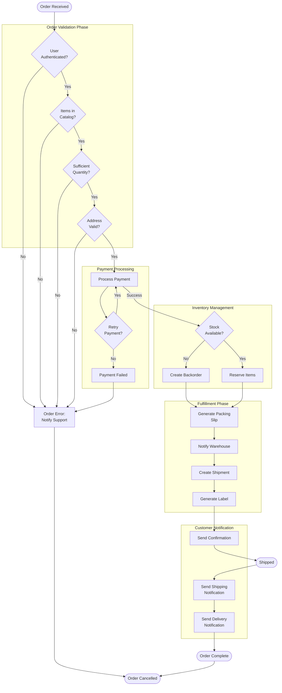

# Large Flowchart

Complex diagram with 30+ nodes demonstrating hierarchical layout and organization strategies.

## Use Case: Order Processing System

This large flowchart demonstrates how Mermaid handles complex diagrams with many nodes. The diagram uses subgraphs for logical grouping, hierarchical arrangement, and shows various decision points and process flows in an order management system.

### Key Features
- Subgraph grouping for logical organization
- 30+ nodes showing complexity handling
- Multiple decision branches
- Error handling paths
- Clear hierarchical flow

### Layout Strategies Demonstrated
- **Subgraph Grouping**: Logical organization into Processing, Validation, and Fulfillment phases
- **Hierarchical Arrangement**: Top-down flow showing progression through stages
- **Node Clustering**: Related decisions grouped together visually
- **Multiple Exits**: Different paths for success and error scenarios
- **Long Label Handling**: Nodes contain descriptive text without breaking layout

## Diagram

## Complexity Analysis

**Total Nodes**: 35+ | **Decision Points**: 8 | **Process Steps**: 15+ | **Subgraphs**: 5

This diagram demonstrates Mermaid's ability to handle complex workflows with multiple decision branches, parallel processes, and comprehensive error handling. The hierarchical layout keeps the diagram organized and readable despite its complexity.

## Learning Tips

When creating large flowcharts: organize into logical phases using subgraphs, keep main flow top-to-bottom, show error handling separately, use descriptive labels, test at different zoom levels to ensure readability.
