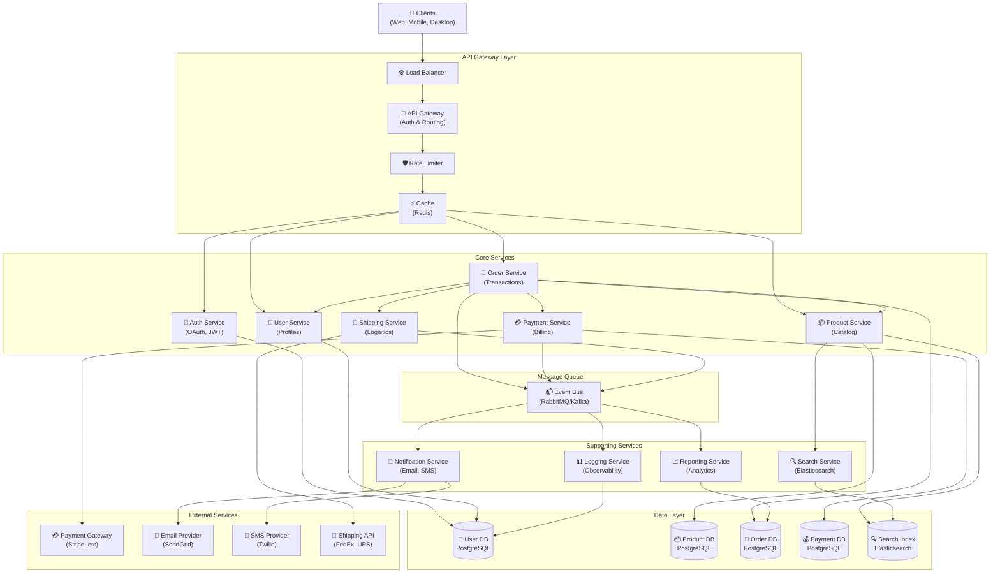

# Microservices Architecture

15+ interconnected services showing layered architecture and communication patterns.

## Use Case: Enterprise Microservices Platform

This diagram visualizes a complex microservices architecture with 15+ interconnected services across multiple layers. It demonstrates real-world service dependencies, communication patterns, and data flow in a modern distributed system.

### Key Features
- Layered architecture (API Gateway → Services → Data)
- Service grouping by business domain
- Bidirectional communication
- Multiple relation types (sync/async)
- External integrations
- 11+ core services plus 4 supporting services

### Layout Strategies Demonstrated
- **Layered Architecture**: Clear separation between API Gateway, Core Services, and Data Layer
- **Service Grouping**: Related services grouped by business domain
- **Bidirectional Communication**: Services calling each other
- **Multiple Relation Types**: Different arrow styles for sync/async
- **External Integration**: Third-party services distinguished visually

## Diagram

## Architecture Metrics

**Services**: 11 core + 4 supporting | **Data Stores**: 5 | **External Integrations**: 4 | **Communication Patterns**: Sync (REST), Async (Events)

This complex architecture demonstrates real-world patterns including API Gateway pattern, service-to-service communication, event-driven architecture with message queues, and multi-database approach (polyglot persistence).

## Learning Tips

Design for scalability: each service can scale independently. Use API Gateway for cross-cutting concerns. Implement event-driven communication for loose coupling. Consider data consistency patterns (eventual consistency vs strong consistency). Monitor service health and communication patterns.
