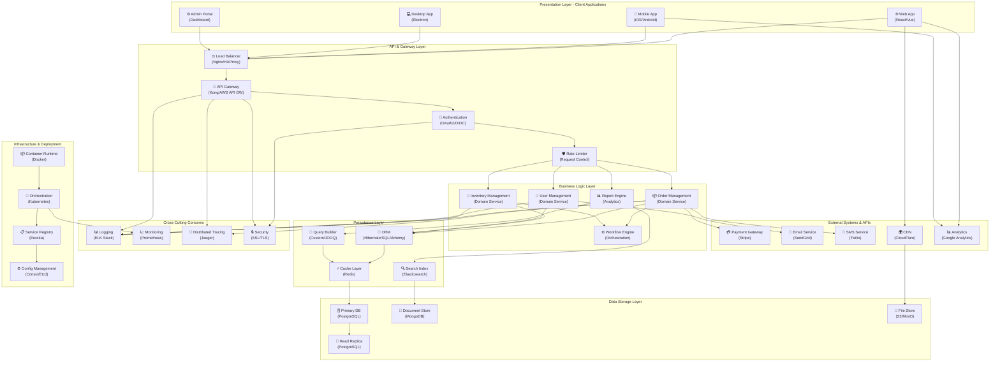

# Multi-Layer Enterprise Architecture

Layered system with presentation, business, data, and infrastructure layers showing enterprise patterns.

## Use Case: Enterprise Application Stack

This comprehensive multi-layer architecture demonstrates a typical enterprise system with clear separation of concerns across presentation, business logic, persistence, and infrastructure layers. It shows how components interact across layers and with external systems.

### Key Features
- Presentation, business, persistence, and infrastructure layers
- Cross-layer communication patterns
- 29 total components
- Support services (logging, monitoring, security)
- External system integrations

### Layout Strategies Demonstrated
- **Horizontal Layering**: Clear separation into logical layers
- **Cross-Layer Communication**: Shows dependencies between layers
- **Responsibility Segregation**: Each layer has specific concerns
- **External Integrations**: Third-party services and legacy systems
- **Support Services**: Monitoring, logging, and configuration management

## Diagram

## Architecture Metrics

**Presentation Components**: 4 | **Business Services**: 5 | **Data Sources**: 4 | **Infrastructure**: 4 | **External Integrations**: 5 | **Cross-Cutting Services**: 4

This enterprise architecture demonstrates how large-scale systems organize components across multiple layers with clear separation of concerns. The layered approach enables teams to work independently on different layers, facilitates testing and deployment, and makes the system maintainable as it grows.

## Learning Tips

Design layers with single responsibility. Keep dependencies flowing downward (presentation depends on business, business on persistence). Use cross-cutting concerns to handle security, logging across all layers. Design for independence so layers can be tested and deployed separately. Plan for scalability at each layer.
